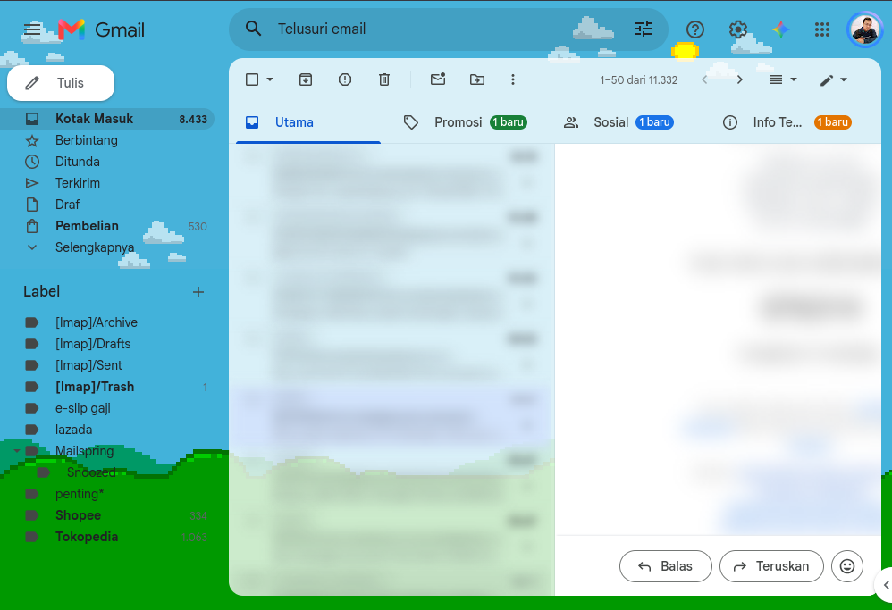

# Gmail Blur Privacy for Firefox

Protect your inbox from shoulder surfers. This extension blurs senders,
subjects, snippets, and message bodies in Gmail — hover to peek, click to
keep a message visible.

☕ [Buy me a coffee](https://buymeacoffee.com/amdkholil) — support development.

## Example

Inbox and message view blurred — hover a row to peek, click to pin it visible:

## Install

Get it from **Firefox Add-ons**:

> Add-on listing is in review — the install link will appear here once
> published.

## How to use

- Open Gmail — sensitive text appears blurred.
- **Hover** any email row to peek at it; move the mouse away to blur it again.
- **Click** a row to keep it visible (click again to re-blur).
- Inside an open message, hover or click the subject/body to reveal it.
- Click the toolbar icon to switch blur off/on entirely (useful on trusted
  screens). Your choice is remembered.

## Privacy

- Everything runs locally in your browser. No accounts, no analytics,
  no network requests.
- The only thing stored is your on/off toggle.
- Blur hides content visually — it is not encryption. The page source and
  DevTools can still show the text. See [SECURITY.md](SECURITY.md).

## Compatibility

- Firefox 58+ (desktop).
- Gmail web (`mail.google.com`, `gmail.com`).
- Gmail occasionally changes its layout; if blur stops working after a
  Gmail update, please open an issue (see below) and we'll update it.

## Permissions — why each one?

| Permission | Why |
|---|---|
| Access to `mail.google.com` / `gmail.com` | To blur the Gmail page content. Nothing else. |
| `storage` | To remember your on/off toggle on your own device. |

## Issues & support

Found a bug or Gmail changed its layout? Please open an issue at
<https://github.com/amdkholil/firefox-gmail-blur-privacy/issues> with:

- Extension version, Firefox version
- Which Gmail view (Inbox / Search / open message)
- What you expected vs. what happened

Security-sensitive reports: see [SECURITY.md](SECURITY.md) — please don't
file them as public issues.

## Contributing

Want to help or hack on it? See [CONTRIBUTING.md](CONTRIBUTING.md).

## More docs

- [CHANGELOG.md](CHANGELOG.md) — release history.
- [SECURITY.md](SECURITY.md) — privacy model and reporting.
